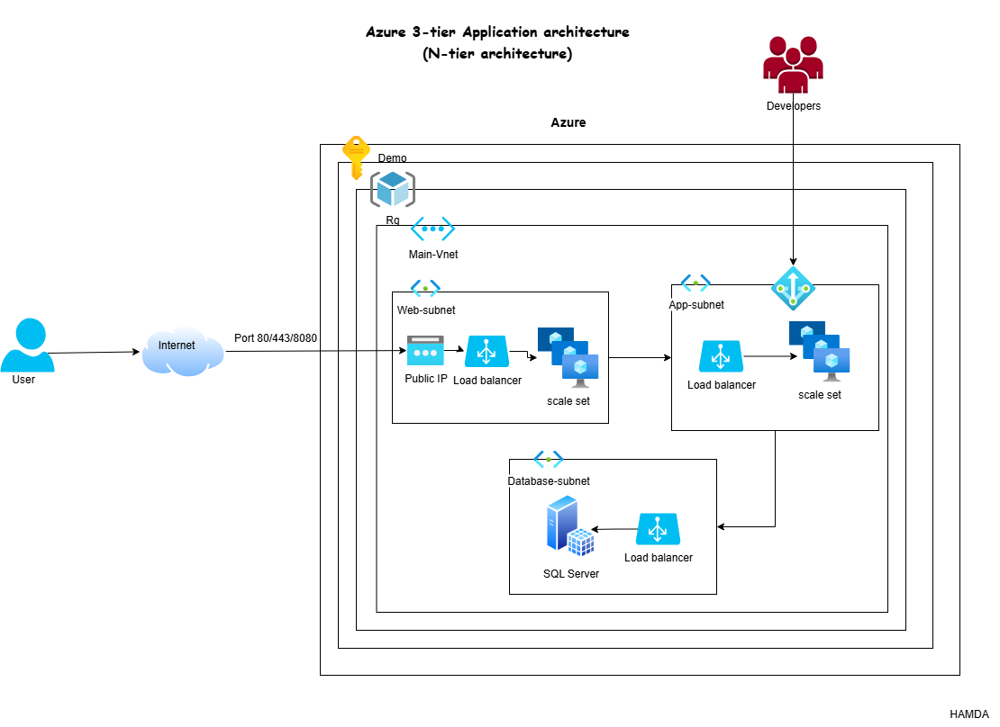

## Project Objectives

- Design and implement a scalable 3-tier application architecture.
- Demonstrate separation of concerns by dividing the application into presentation, logic, and data layers.
- Utilize modern technologies and best practices for deployment, security, and maintainability.
- Provide clear documentation and reproducible steps for setup and usage.
- Showcase integration between frontend, backend, and database components.

## Conclusion

This project successfully demonstrates the implementation of a 3-tier architecture, highlighting modularity, scalability, and maintainability. By separating the application into distinct layers, it ensures easier management, improved security, and flexibility for future enhancements. The repository serves as a practical reference for building robust multi-tier applications using contemporary tools and methodologies.

## Project Prerequisites

To set up and run this project, ensure you have the following:

1. **Node.js and npm**  
   Download and install from [https://nodejs.org/](https://nodejs.org/).

2. **Docker and Docker Compose**  
   Download and install from [https://www.docker.com/products/docker-desktop](https://www.docker.com/products/docker-desktop).

3. **Git**  
   Download and install from [https://git-scm.com/](https://git-scm.com/).

4. **Database**  
   Access to a supported database (e.g., PostgreSQL, MySQL, or MongoDB).  
   You can use Docker Compose to run a database container if needed.

### Setup Steps

1. Clone the repository:  
   `git clone https://github.com/hamda66/3-tier-app-project.git`

2. Navigate to the project directory:  
   `cd 3-tier-app-project`

3. Install dependencies for each tier 

4. Configure environment variables as needed.

